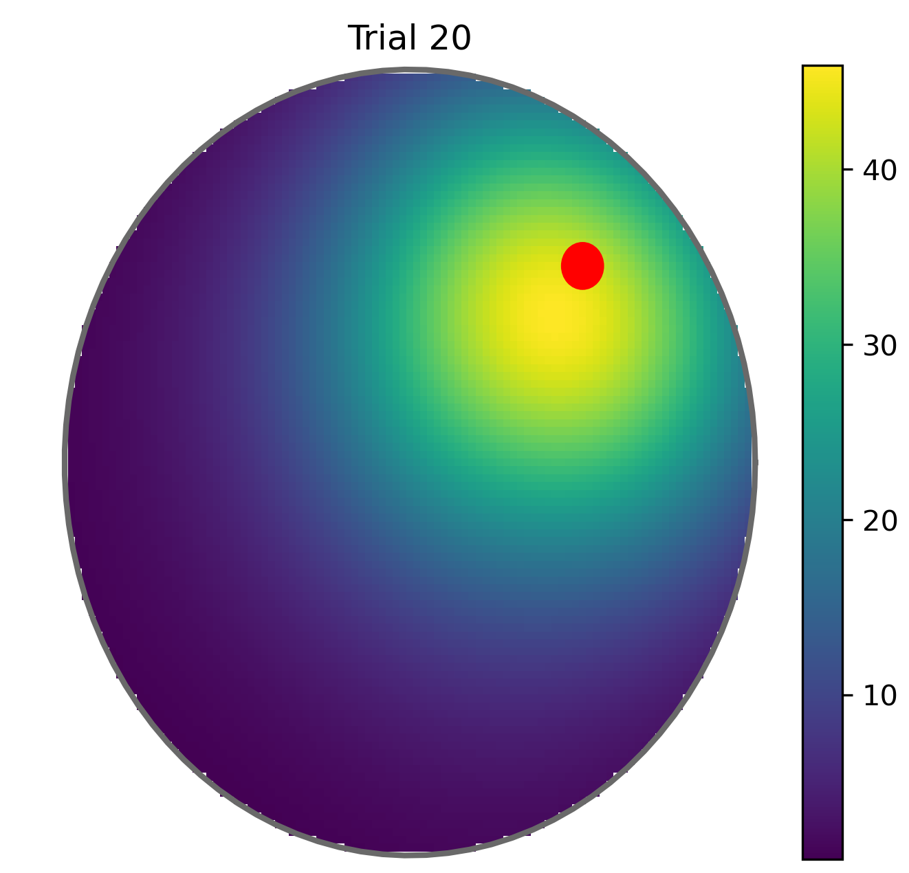

# Continuous Actor-Critic Learning with Place Cells

This repository implements a continuous actor-critic reinforcement learning model for spatial navigation using place cells, as described in my [PhD thesis](https://eprints.nottingham.ac.uk/67019/) ([Tessereau, 2021](https://eprints.nottingham.ac.uk/67019/)). This is a rate network implementation of [Frémaux et al., 2013](https://journals.plos.org/ploscompbiol/article?id=10.1371/journal.pcbi.1003024). The model learns to navigate in a circular arena to find a hidden platform, similar to the Morris Water Maze task.

## Installation

1. Clone the repository:
```bash
git clone https://github.com/charlinetessereau/ContinuousActorCritic.git
cd ContinuousActorCritic
```

2. Create and activate the conda environment:
```bash
conda env create -f environment.yml
conda activate actor-critic
```

## Project Structure

- `loop.py`: Core implementation of the actor-critic model
  - Place cell encoding
  - Actor network for action selection
  - Critic network for value estimation
  - Reward dynamics for goal finding
  
- `analysis.py`: Analysis and visualization tools
  - Learning curve plotting
  - Trajectory visualization
  - Parameter comparison tools

## Quick Start

1. Run the experiment:
```python
from main import initialize_parameters, experiment

# Initialize parameters and run experiment
params = initialize_parameters()
features = params.pop('features')  # Remove features from params dict
experiment(params, features, 'results.h5')
```

2. Visualize learning through latencies:
```python
from analysis.learning_plots import plot_learning_curve

# Plot learning curve
plot_learning_curve('results.h5', metric='latency', save_path='learning_curve.png')
```

We can verify that the agent learns by looking at the average time (number of steps) that they need to reach the goal with repeated exposure to the same goal location:


We can see that it decreases, which is a proxy for learning.

3. Examine the value function:
```python
from analysis.value_plots import plot_value_comparison

# Plot value function after learning
plot_value_comparison('results.h5', rat_idx=0, trial_idx1=19, save_path='value_function.png')
```



We can see that the value function after learning peaks at the reward location.

4. Compare decision-making dynamics before and after learning:
```python
from analysis.visualize import setup_figure, setup_lines, load_trial_data
import matplotlib.animation as animation

# Setup visualization
fig, axes = setup_figure()
lines = setup_lines(axes)

# Generate early learning video
data = load_trial_data('results.h5', rat_index=0, trial_index=0)
anim = animation.FuncAnimation(fig, update_plot, frames=len(data['history_ua']), 
                             fargs=(data, lines, axes), interval=50)
anim.save('early_learning.mp4', writer='ffmpeg', fps=30)

# Generate late learning video
data = load_trial_data('results.h5', rat_index=0, trial_index=19)
anim = animation.FuncAnimation(fig, update_plot, frames=len(data['history_ua']), 
                             fargs=(data, lines, axes), interval=50)
anim.save('late_learning.mp4', writer='ffmpeg', fps=30)
```

The videos show the different components that feed the actor dynamics: the input from the place cells (learned) and the noise input (varying with the degree of learning). The vertical bar shows the residual decision on direction.

## Model Parameters

The model's parameters can be adjusted in `params.yaml`. Key parameters include:

- **Environment**:
  - Arena radius: 100 cm
  - Goal radius: 5 cm
  - Movement speed: 30 cm/s
  - Trial duration: 120 s

- **Place Cells**:
  - Number of cells: 500
  - Field width (σ): 30 cm
  - Maximum firing rate: 1 Hz

- **Actor Network**:
  - Action cells: 180 (one per 2 degrees)
  - Learning rate: 0.01
  - Noise decay time: 0.3 s

- **Critic Network**:
  - Learning rate: 0.1
  - Value scaling: 0.99

Feel free to experiment with different values to explore their impact on learning dynamics.

## Results

The model learns to:
1. Navigate efficiently to the platform
2. Avoid walls
3. Develop direct trajectories to the goal
4. Adapt to different platform locations

## Contributing

Feel free to open issues or submit pull requests. Areas for improvement include:
- Additional analysis tools
- Parameter optimization
- Performance improvements
- Documentation enhancements

## References

1. Tessereau, Charline. "Reinforcement Learning Approaches to Rapid Hippocampal Place Learning." Diss. University of Nottingham, 2021.

2. Frémaux, Nicolas, Henning Sprekeler, and Wulfram Gerstner. "Reinforcement learning using a continuous time actor-critic framework with spiking neurons." PLoS computational biology 9.4 (2013): e1003024. 
